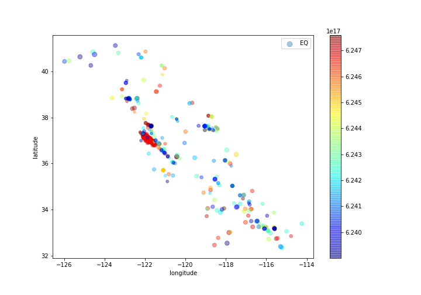
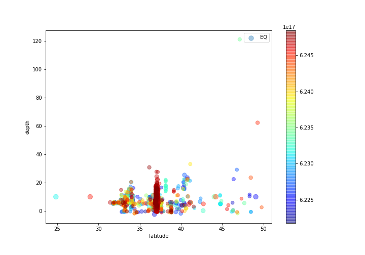

# Earthquake sequence forecast using a coupled clustering/time-series anomaly detection
## A practical approach for risk analysis of the "Big One"
<br>

### Problem statement:

San Andreas fault extends nearly 700 miles from NW-SE California along the coast. This fault is responsible for the notorious 1906 San Francisco Earthquake, and the later Loma Prieta and Parkfield earthquakes. Can we train a model on Lomé Prieta and see whether the mode validates on Parkfield? How certain can we be of the developed model?

### Historic California Earthquakes with M > 6[link](https://scedc.caltech.edu/significant/chron-index.html):

| Earthquake | Date | Magnitude | Casulaty | Economic damage | Link |
| --- | --- | --- | --- | --- | --- |
| Ridgecrest | July 5, 2019 | 7.1| --- | 1B | --- |
| Ridgecrest | July 4, 2019 | 6.4| --- | --- | --- |
| American Canyon (South Napa) | August 24, 2014 | 6.0| 1 | 0.4 B | --- |
| El Mayor-Cucapah (Baja CA/Mexico) | April 4, 2010 | 7.2 | --- | --- | --- |
| Eureka | January 9, 2010 | 6.5 | --- | --- | --- |
| Parkfield | September 28, 2004 | 6.0 | --- | --- | --- |
| San Simeon | December 22, 2003 | 6.5 | 2 | --- | --- |
| Hector Mine  | October 16, 1999 | 7.1 | --- | --- | --- |
| Mendocino | 1 September 1994 | 7.0 | --- | --- | --- |
| Northridge | January 17, 1994 | 6.7 | --- | 20 | --- |
| Landers & Big Bear | June 28, 1992 | 7.3 | --- | --- | --- |
| Cape Mendocino | April 25, 1992 | 7.2 | --- | --- | --- |
| Loma Prieta (World Series) | October 17, 1989 | 6.9 | --- | --- | --- |
| Chalfant Valley | July 21, 1986 | 6.5 | --- | --- | --- |
| Morgan Hill  | April 24, 1984 | 6.2 | --- | --- | --- |
| Coalinga | May 2, 1983 | 6.7 | --- | --- | --- |
| Humboldt | November 8, 1980 | 7.0 | --- | --- | --- |
| Eureka | 8 November 1980 | 7.2 | --- | --- | --- |

### Project structure and model 
The project directory is structured as follows:

---
```
project-SES
    
|__ assets/
|__ codes/
|  |P01_API_Request_usgs.ipynb
|  |P02_Data_Cleaning.ipynb
|  |P03_EDA_eq.ipynb
|  |P04_model_linear_regression.ipynb
|  |P05_model_clustering_features.ipynb
|  |P06_model_apply_to_parkfield.ipynb
|__ datasets/
|__ plots/
|__ Executive_summary_slides.pdf
|__ README.md
```
---

### - Instructions for running and reproducing the model results
After cloning the repository, run the notebooks (under "codes/" directory) with the sequence that is laid out in the above project directory table. The figures will be automatically saved into "plots/" directory.

### Model Workflow:
The modeling process in the current blog post is comprised of the following consecutive steps: 1 - Data collection. 2 - data cleaning. 3 - exploratory data analysis (EDA). 4 - Time-series modeling. 5 - Recommendations.<br>


### Data Preparation

The Earthquake data from San Andreas fault was collected from USGS API, which was publicly available. We selected earthquakes from a single fault to compare, hoping to at least isolate the fault structure effects and focus on the earthquake time-series. For this study, we worked on 6.9-magnitude Loma Prieta (1989) and 6.0-magnitude Parkfield (2004) Earthquake data. These earthquakes occurred the locked and creeping segments of the San Andreas fault, respectively. Although the magnitude of the Parkfield was expected, its timing was not expected, making it an interesting test dataset for our model effort.

<div style="text-align:center"></div>
Figure 1. San Andreas fault geometry, where the notorious Loma Prieta and Parkfield earthquakes occurred. [Source: USGS graphic]<br><br>


[USGS API](https://earthquake.usgs.gov/fdsnws/event/1/#methods): Also, important [link](https://earthquake.usgs.gov/data/comcat/data-eventterms.php#rms)
So, keeping all the things in mind, I have decided to go with the United States Geological Survey(USGS) for earthquake data. USGS provides a very intuitive, easy-to-use, reliable API and web portal service, which provides flexibility in output format, specifying regions of interest and more. USGS is a government-operated research center and the data they provide are free of cost and are very reliable because most of them are reviewed by humans before their registration. The API request link does not require any authentication.
### EDA

The downloaded data contained a wealth of data, including the moment magnitudes and inverted three - dimensional location of the earthquakes. Plus, even earthquakes as small as magnitude 1. An initial look at the temporal evolution of the magnitudes suggested a sudden spike in the time-series, without much early notice. This suggests that simple time-series analysis techniques such as linear ARIMA, VRA models would not be adequate and we need to consider more sophisticated ML models. Along with trying different models, we also engineered features such as earthquake spatial density as I will elaborate in the next section.

<div style="text-align:center"></div>

<div style="text-align:center"></div>
Figure 1. San Andreas fault geometry, where the notorious Loma Prieta and Parkfield earthquakes occurred. <br>
### Modeling
After initial linear regression attempts, I decided to make a hybrid model, which combines the clustering analysis with linear regression. For clustering, I used DBSCAN and then inferred some engineering features related to:<br>
1- event density<br>
2 - aspect ratio (std)<br>
3 – mass center transformation<br>
Based on the correlation, the engineered features seem relevant, meaning that the clustering analysis in fact has taken lots of non-linearities in the earthquake occurrence into account:
<div style="text-align:center"></div>
And, below is the feature importance figure:
<div style="text-align:center"></div>

I finally tried this hybrid modeling technique on a new dataset, belonging to Parkfield earthquake. It resulted in R^{2} value of 0.98 However, the model could still be more stable, as it is yet overfit.
### Recommendations
1 - Apply this analysis to other earthquakes in other fault systems and see whether it generalizes.

2 - If it generalizes, then using the wealth of data to look into deep learning techniques in detecting these times-series anomalies.
