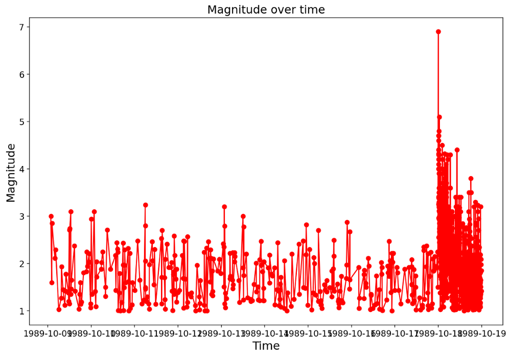
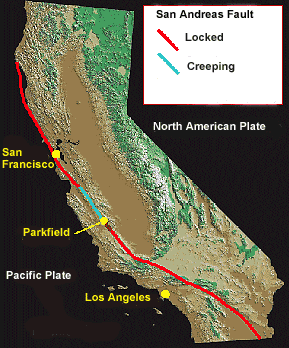
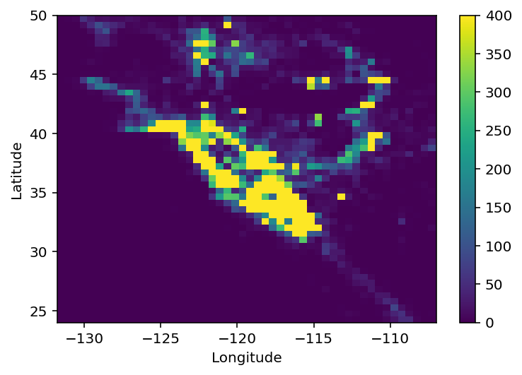
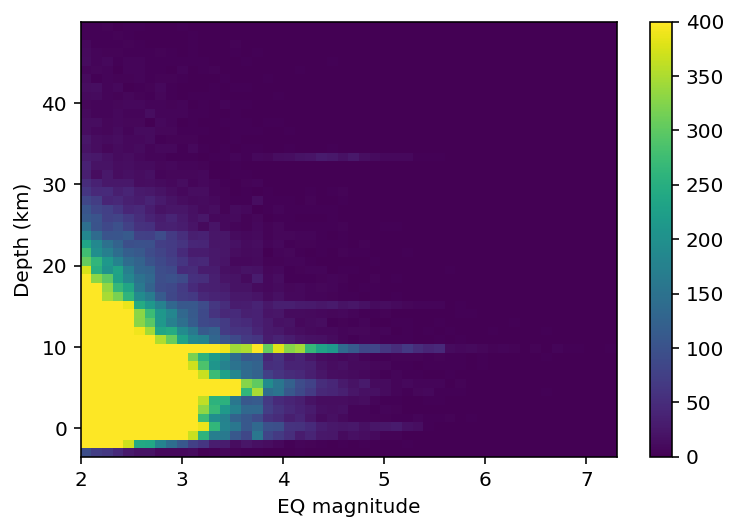
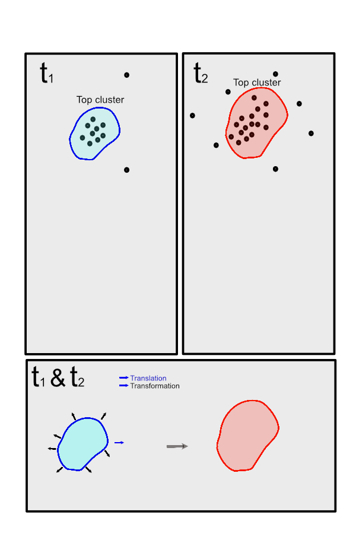
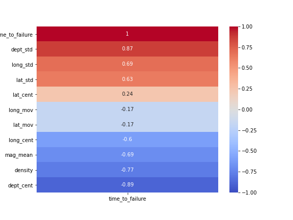
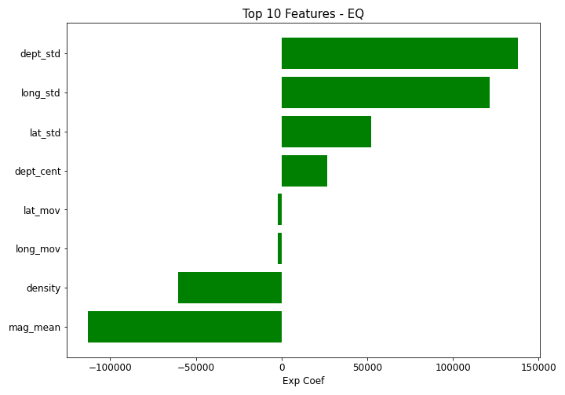
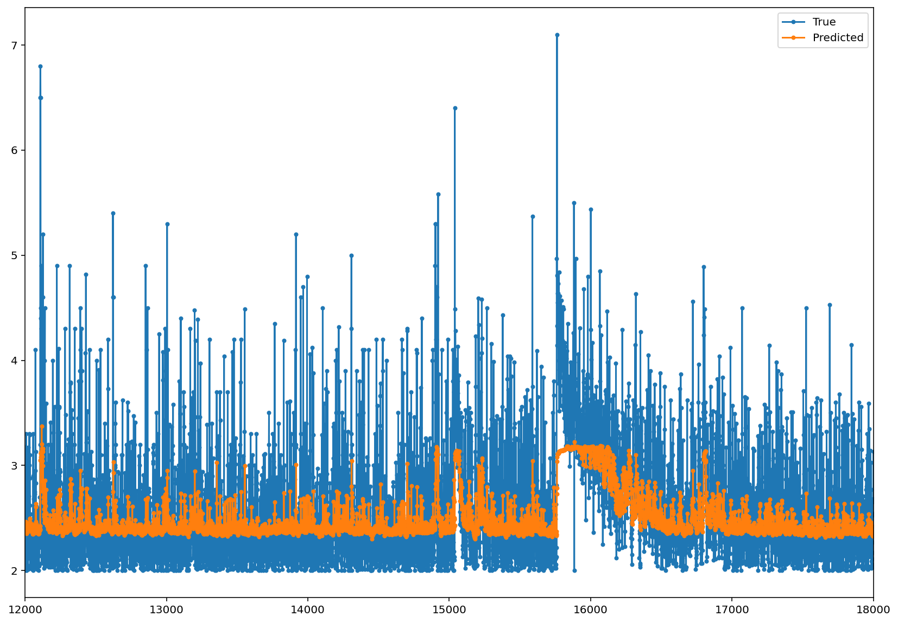

# Earthquake Time-series Forecasts using a Hybrid Clustering-LSTM Approach
## Testing the method on the last 50 years of California’s historic earthquakes
<br>

### [Medium article: part I](https://towardsdatascience.com/earthquake-time-series-forecasts-using-a-hybrid-clustering-lstm-approach-part-i-eda-6797b22aed8c)

### Difficulties with Forecasting Earthquake Time-series
Figure below shows the sequence of foreshocks (before the main earthquake), the main magnitude 6.9 earthquake, and the aftershocks (following the main earthquake), during the 1989 Loma Prieta earthquake (63 casualties, 10 billion dollars damage). The main earthquake occurred almost without any large precursory signals. This complicates the task of earthquake forecast for more conventional time-series models such as the autoregressive ones.
<div style="text-align:center"></div>
Figure: Earthquake sequences during the magnitude 6.9 Loma Prieta occurred in 1989. Note the occurrence of main earthquake without prior precursory large events (Image by author).

### Problem statement:

San Andreas fault extends nearly 700 miles from NW-SE California along the coast. This fault is responsible for the notorious 1906 San Francisco Earthquake, and the later Loma Prieta and Parkfield earthquakes. But, this is not the only fault system, and earthquakes occur on many nearby faults which may even interact in a complex way. Are there any systematics in the occurrence of these earthquakes? And, if there is, can they help us discern how smaller earthquakes grow, leading to larger earthquakes? The analysis here is more data-based rather than being physics-based. This means, any earthquake with any magnitude and at any distance has the same weight of importance to predict the major earthquake; and, there are no prior assumptions. ONLY, the statistical analysis decides on the weight of importance for an earthquake.

### Historic California Earthquakes with M > 6 [link](https://scedc.caltech.edu/significant/chron-index.html):

| Earthquake | Date | Magnitude | Casulaty | Economic damage | Link |
| --- | --- | --- | --- | --- | --- |
| Ridgecrest | July 5, 2019 | 7.1| --- | 1B | --- |
| Ridgecrest | July 4, 2019 | 6.4| --- | --- | --- |
| American Canyon (South Napa) | August 24, 2014 | 6.0| 1 | 0.4 B | --- |
| El Mayor-Cucapah (Baja CA/Mexico) | April 4, 2010 | 7.2 | --- | --- | --- |
| Eureka | January 9, 2010 | 6.5 | --- | --- | --- |
| Parkfield | September 28, 2004 | 6.0 | --- | --- | --- |
| San Simeon | December 22, 2003 | 6.5 | 2 | --- | --- |
| Hector Mine  | October 16, 1999 | 7.1 | --- | --- | --- |
| Mendocino | 1 September 1994 | 7.0 | --- | --- | --- |
| Northridge | January 17, 1994 | 6.7 | --- | 20 | --- |
| Landers & Big Bear | June 28, 1992 | 7.3 | --- | --- | --- |
| Cape Mendocino | April 25, 1992 | 7.2 | --- | --- | --- |
| Loma Prieta (World Series) | October 17, 1989 | 6.9 | 67 | 5 B | [Link](https://en.wikipedia.org/wiki/1989_Loma_Prieta_earthquake) |
| Chalfant Valley | July 21, 1986 | 6.5 | --- | --- | --- |
| Morgan Hill  | April 24, 1984 | 6.2 | --- | --- | --- |
| Coalinga | May 2, 1983 | 6.7 | --- | --- | --- |
| Humboldt | November 8, 1980 | 7.0 | --- | --- | --- |
| Eureka | 8 November 1980 | 7.2 | --- | --- | --- |

### Project structure and model 
The project directory is structured as follows:

---
```
project-SES
    
|__ assets/
|__ codes/
|  |P01_API_Request_usgs.ipynb
|  |P02_Data_Cleaning.ipynb
|  |P03_EDA_eq.ipynb
|  |P04_model_linear_regression.ipynb
|  |P05_feature_eng_parkfield_EQ.ipynb
|  |P06_model_timeseries.ipynb
|__ datasets/
|__ plots/
|__ Executive_summary_slides.pdf
|__ README.md
```
---

### - Instructions for running and reproducing the model results
After cloning the repository, run the notebooks (under "codes/" directory) with the sequence that is laid out in the above project directory table. The figures will be automatically saved into "plots/" directory.

### Model Workflow:
The modeling process in the current blog post is comprised of the following consecutive steps: 1 - Data collection. 2 - data cleaning. 3 - exploratory data analysis (EDA). 4 - Time-series modeling. 5 - Recommendations.<br>


### Data Preparation

I used USGS API to pull the earthquake data for the last 50 years near the state of California. The API is publicly available thanks to USGS. To download an inclusive enough catalog of earthquakes, I downloaded the earthquakes beyond the state of California from a wide longitude and latitude range of (-133, -107) and (24, 50) degrees respectively (well beyond California).

<div style="text-align:center"></div>
Figure: San Andreas fault geometry, where the notorious Loma Prieta and Parkfield earthquakes occurred. [Source: USGS graphic]<br><br>


[USGS API](https://earthquake.usgs.gov/fdsnws/event/1/#methods):
Keeping all the things in mind, I have decided to go with the United States Geological Survey(USGS) for earthquake data. USGS provides a very intuitive, easy-to-use, reliable API and web portal service, which provides flexibility in output format, specifying regions of interest and more. USGS is a government-operated research center and the data they provide are free of cost and are very reliable because most of them are reviewed by humans before their registration. The API request link does not require any authentication.<br>

## Part I - EDA analysis and unsupervised clustering
### 1.1 EDA — 50 years of earthquake data

The downloaded data contained a wealth of information, including the timing of event, moment magnitudes, intensity (evaluated by a human), and inverted three-dimensional location of the earthquakes. For data size considerations, we only considered earthquakes with moment magnitudes larger than 2 as the more important ones.

#### 1.2 Correlation between location and magnitude
To better understand the dataset, I assessed the correlation between variables in the dataframe. The 2D histograms (Figure below) showed that the majority of the earthquakes occurred in NW-SE, loosely aligning with a certain lineation. Also, the magnitude-depth distribution suggested that major earthquakes occurred at a depth of nearly 10 km. This suggests that we can use clustering techniques to come up with some engineered features and try to see whether they help us for the forecast problem.
<div style="text-align:center"></div>
<div style="text-align:center"></div>
Figure: 2D histograms of entire dataset. Top: There is strong lineation NW-SE between longitude-latitude. Bottom: At the depth of ~10 km, there seems to be clustering of major earthquakes (Image by author).<br>

### 1.3 Feature Engineering: Spatial Clustering
Figure below shows a schematic concept for developing the features. As the figure is self-descriptive, I will not go through the explanations. I used DBSCAN algorithm to cluster the events for every 20 consecutive earthquakes beginning from the first datapoint. I used longitude, latitude, and depth for a 3D clustering. We can define three features as a result of clustering:
1 — event density (or spatial size of cluster).
2 — Aspect ratio (3D shape of the cluster).
3- Cluster mass center translation.
[The hyperparameters for the DBSCAN were eps = 0.2 and min_samples=5].
<div style="text-align:center"></div>
Figure: Translation and transformation with time as clusters of earthquake evolve. We could use these changes as features for earthquake forecasts (Image by author).

### 1.4 Feature importance

For an initial assessment on the developed features, I filtered only the section of the time-series data before the main Loma Prieta Earthquake. I averaged the data for every 20 rows and added the features derived from the spatial clustering to the original dataframe columns.
Finally, I added a target label as the time to the main Loma Prieta Earthquake (time_to_failure).<br>
A single regression analysis was run for preliminary assessment of the features. Note that this regression is only for exploratory purposes, and the results need to be cross-validated on other distinct test earthquake datasets as a future effort. The following correlation map (Figure below) shows that the features are in fact strong indicators of the time to the main earthquake.<br>
<div style="text-align:center"></div>
Figure: Correlation between features and the target label (time_to_failure). As can be seen, these are strong indicators of the time to failure. See GitHub repository for full description of columns (Image by author).<br>
The feature importance plot in Figure below showed interesting implications. The dept_std, long_std, and lat_std, indicate the aspect ratio of the cluster. This means closer to the failure, the cluster tends to elongate more vertically and longitudinally and less latitudinally. These were the strongest features. Also, density is negatively correlated, meaning that the size of the cluster expands before failure. Another interesting aspect is the mean magnitude of earthquakes which is a curious case. An inspection of the dataset for a few other earthquakes also showed this trend. This means that before the main earthquake happens, the mean magnitude of events in fact declines. In other words, the fault becomes more seismically silent. This is a curious case and needs further study.<br>
<div style="text-align:center"></div>
Figure: Feature importance based on linear regression on Loma Prieta earthquake. Features are discussed in the text. See GitHub repositopry for full description of columns (Image by author).

I finally tried this hybrid modeling technique on a new dataset, belonging to Parkfield earthquake. However, the model could still be made to be more stable, as it is yet overfit.
## Part II - Time-series anlaysis using LSTM (regression approach)
### 2.1 Multi-variate LSTM preliminary results

I found LSTM as an appropriate method for my purposes. Two aspects specifically brought my interest towards LSTM sequential analysis: 1 — the irregular nature of my time-series. 2 — the shock-like (anomaly) nature of the earthquake without much apparent precursors. My target label here is "momet magnitude" values. I used the first 45 years of earthquake to predict the moment magnitudes for the last 5 years using LSTM (timestep of 60). Figure below shows an initial result:
<div style="text-align:center"></div>
Figure: Preiminary LSTM results, considering only the location and timing labels. Future efforts will incorporate the engineered clustering features as well.

Although the model slighly underpredicts the amplitude of magnitudes globally, still it can capture the main shock events (e.g., around x-values of 12,000, 15,000 and 16,000 in the above plot which were all earthquakes with magnitude > 6), which seems promising for future efforts.

## Future work

Next, I will implement the spatial clustering features into the LSTM model for improved model metrics.